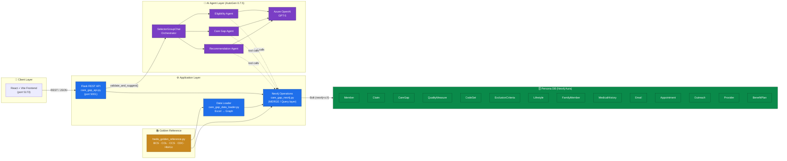
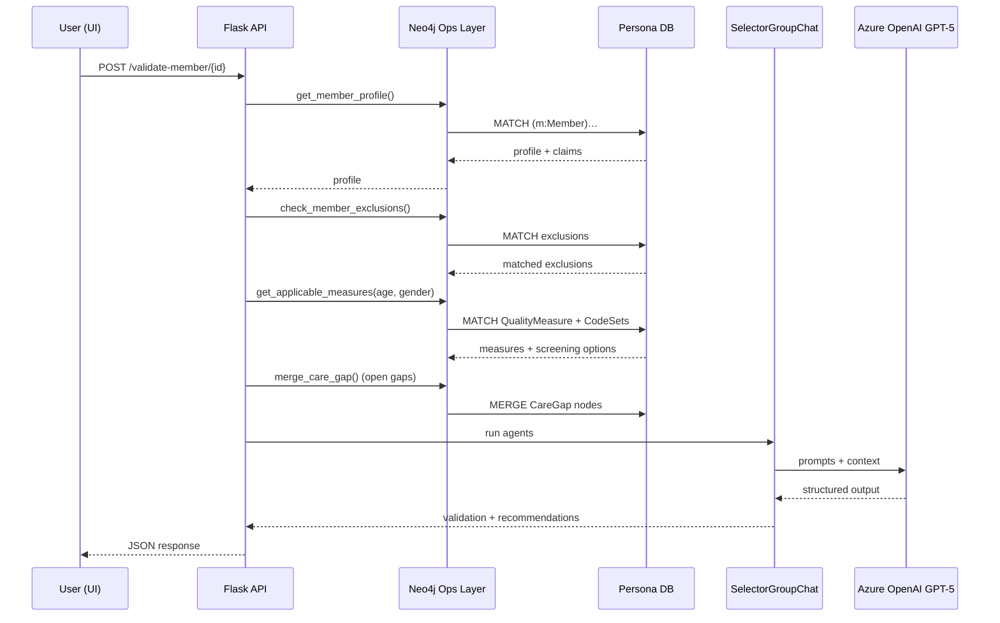

# HEDIS Care Gap System — Architecture

## High-Level Architecture

## Request Flow — `validate_and_suggest(member_id)`

## Stack Summary

| Layer | Technology |
|---|---|
| Frontend | React + Vite (port 5173) |
| Backend | Flask REST API (port 5001) |
| AI Agents | AutoGen 0.7.5 `SelectorGroupChat` |
| LLM | Azure OpenAI GPT-5 |
| Database | **Persona DB** — Neo4j Aura cloud (Bolt protocol, `neo4j+s://`) |
| Rules Source of Truth | `hedis_golden_reference.py` (Python dict) |
| Startup | `start_servers.bat` |

## Persona DB — Node Inventory

The single Persona DB contains all of:

- **Patient/clinical:** Member, Claim, CareGap, Lifestyle, FamilyMember, MedicalHistoryEntry, Condition
- **Workflow:** Email, Appointment, Outreach
- **Reference (rules-as-graph):** QualityMeasure, CodeSet, ExclusionCriteria, ScreeningOption, ClinicalGuideline, BestPractices
- **Network:** Provider, BenefitPlan

## HEDIS Measures Supported

- **BCS** — Breast Cancer Screening (F, 42–74, 24mo)
- **COL** — Colorectal Cancer Screening (45–75, 120mo, 5 screening options)
- **CCS** — Cervical Cancer Screening (F, 21–64, 36mo, 3 screening options)
- **CDC-HbA1c** — Diabetes Care (18–75 with E11.x, 12mo)
